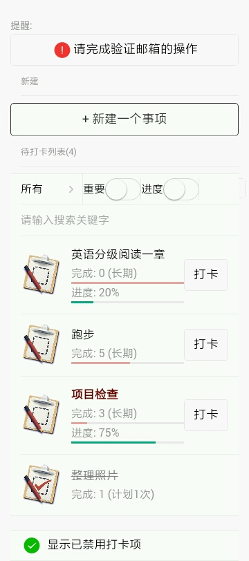
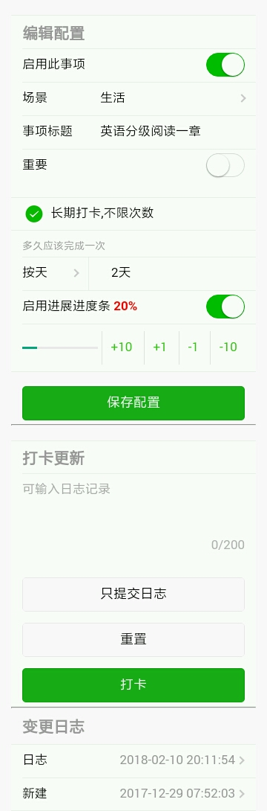
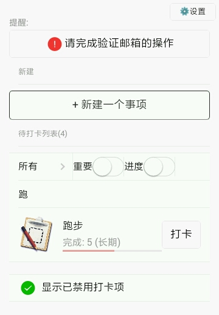
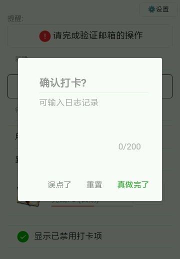
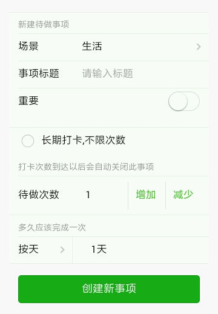
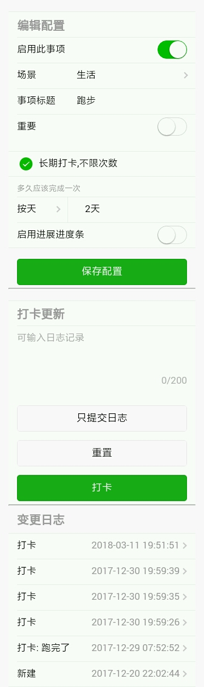

# 介绍

f1do 是一个效率工具站点,目前只有一个功能:**待做事项的打卡**

# 网址

- 站点: https://www.f1do.com
- 报告问题请到: [这里](https://github.com/zhangchunlin/f1do.com/issues)

# 缘起

周筠老师的[保持较低的动力，每天进步一点点](https://mp.weixin.qq.com/s?__biz=MzI2MzQ4ODcwMg==&mid=2247483929&idx=1&sn=8427ce9f8e3075c76c9b147bc8ff2e3b&chksm=eaba57c8ddcddedec5403ae17d1a333916fc6252da27365fe22d0401e1c692cca3a801d55f32)这篇文章对我影响挺大的,其实生活和工作中我有很多想坚持做的时候,不是像文章里说的"突然有高涨的动力，往往耗尽了资源"就是时间长了事情多了慢慢忘了去做,这个站点的打卡功能就是用来辅助这方面而开发的.

当然我一开始并没有想着自己开发,试用过一段时间打卡的小程序,比如"小打卡"算是里面最好的一个了,但是用起来我碰到的问题有:

1. 不能直接在列表上打卡
2. 打卡周期只能按天,多了以后心理压力太大
3. 后来的版本打卡必须写日志,很不方便
4. 一些简单的功能都要收费

用web站点实现也有一些不好的地方:

1. 不能像小程序那样有群方面的功能,但这部分对我来说没什么用
2. 不能像小程序那样方便用微信提醒,但因为自己主动去看,更会有自发自觉地感觉

# 技术框架

- 后端: [python框架uliweb](http://limodou.github.io/uliweb-doc/zh_CN/index.html)
- 前端: [vuejs](https://cn.vuejs.org/) 和 [weui](https://weui.io/)

# 测试帐号

username: testuser

password: test

# 功能特性

1. 待做事项列表
   1. 根据事项的配置,按照**提醒值**进行排序
      1. 提醒值=100*(从建立或者上一次打卡过去的时间/预设打卡时间)
   2. 列表可以根据场景(只有工作和生活两种)和标题关键字进行过滤
2. 事项打卡周期可以有多种设置
   1. 预设**有限**次数,打完卡则会自动禁用
   2. **长期**打卡不限次数
   3. 打卡周期可以按:**小时/天/周/月**
3. 打卡
   1. 可以**在列表直接打卡**,也可以进入事项编辑打卡
   2. 打卡的同时也可以写上日志,也可以在没有完成打卡的情况下**只记录日志**

# 屏幕截图

### 待做事项列表(下方有显示禁用打卡的选项)

### 事项编辑界面

### 列表标题搜索过滤

### 在列表上直接打卡

### 新建事项界面

### 在事项编辑界面打卡

