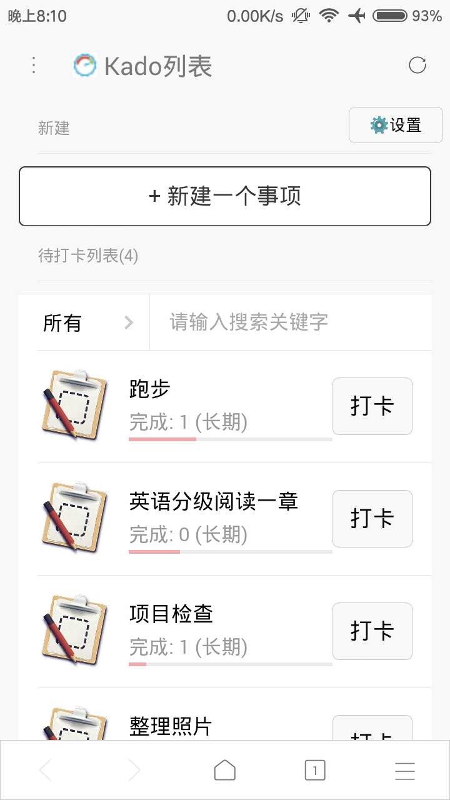
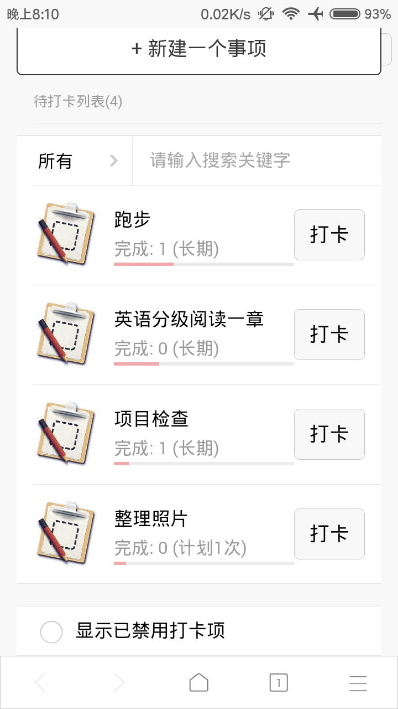
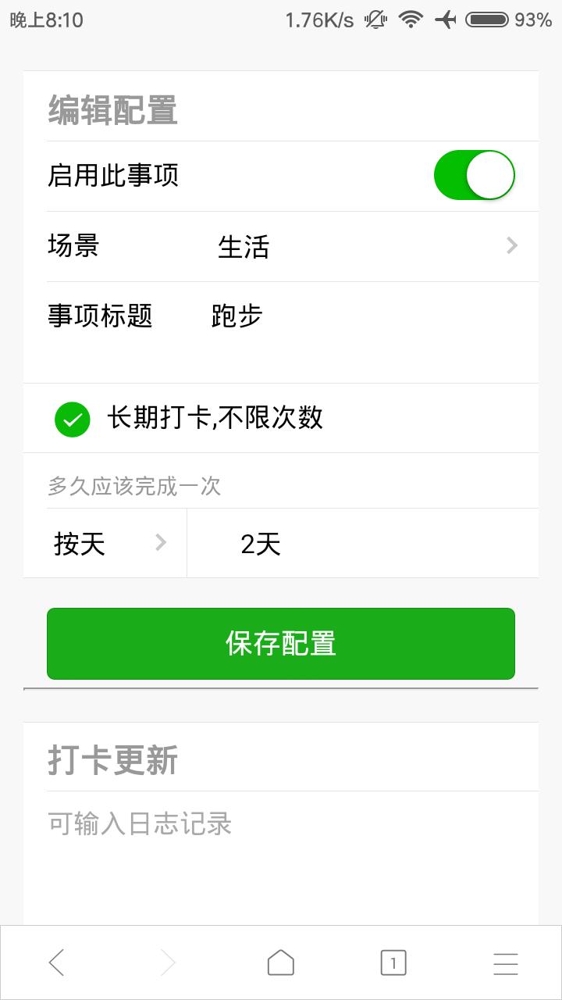
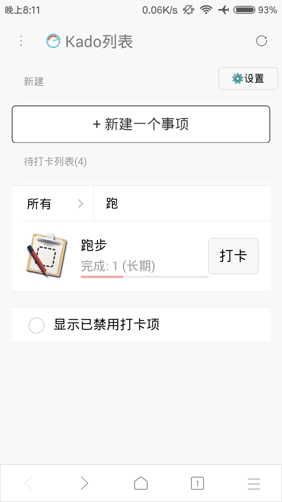
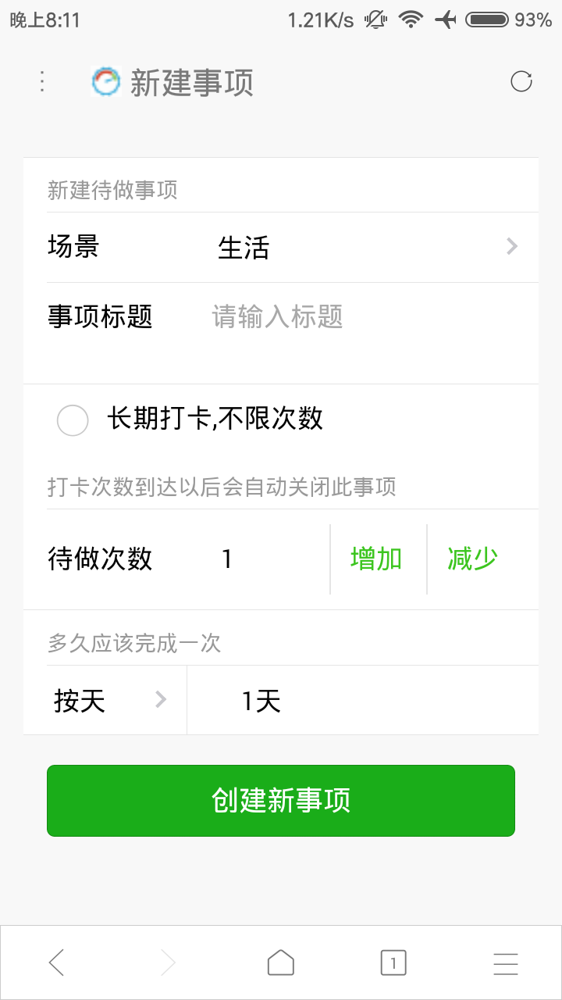
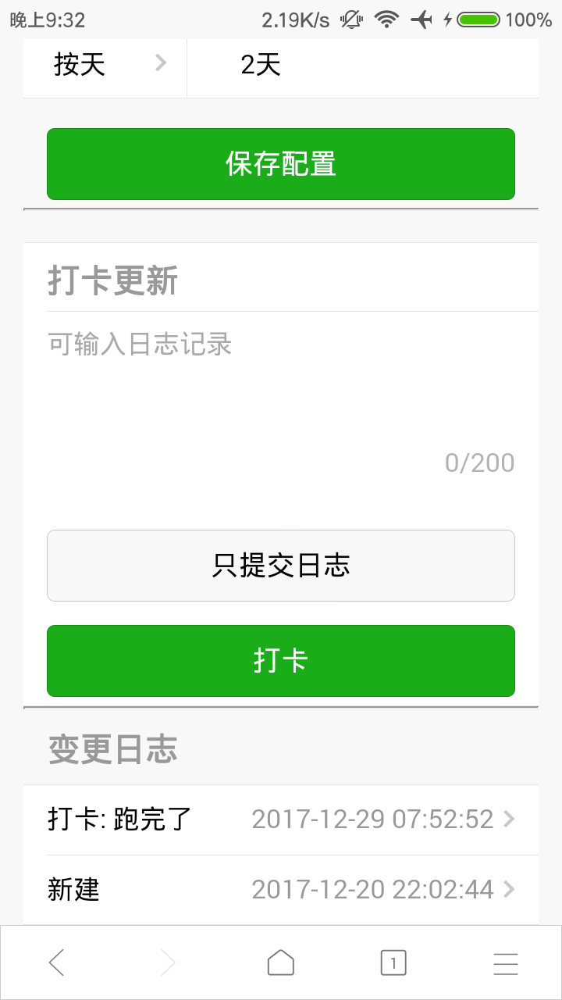

# 介绍

f1do 是一个效率工具站点,目前只有一个功能:**待做事项的打卡**

# 网址

- 站点: https://www.f1do.com
- 报告问题请到: [这里](https://github.com/zhangchunlin/f1do.com/issues)

# 测试帐号

username: testuser

password: test

# 功能特性

1. 待做事项列表
   1. 根据事项的配置,按照**提醒值**进行排序
      1. 提醒值=100*(从建立或者上一次打卡过去的时间/预设打卡时间)
   2. 列表可以根据场景(只有工作和生活两种)和标题关键字进行过滤
2. 事项打卡周期可以有多种设置
   1. 预设**有限**次数,打完卡则会自动禁用
   2. **长期**打卡不限次数
   3. 打卡周期可以按:**小时/天/周/月**
3. 打卡
   1. 可以**在列表直接打卡**,也可以进入事项编辑打卡
   2. 打卡的同时也可以写上日志,也可以在没有完成打卡的情况下**只记录日志**

# 屏幕截图

### 待做事项列表

### 下方有显示禁用打卡的选项

### 事项编辑界面

### 列表标题搜索过滤

### 在列表上直接打卡

### 新建事项界面

### 在事项编辑界面打卡

